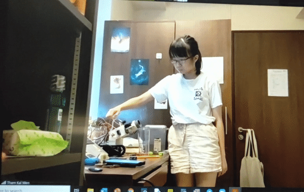
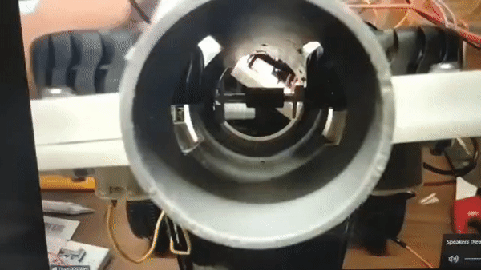

<a href="http://github.com/TetrisCat/auto_nav"></a>

# 2020 EG2310 Group 7 Modified Raspberry pi codes

> Scripts to run on the raspberry pi for targeting

[](https://travis-ci.org/badges/badgerbadgerbadger) 

- Tested and ran on ROS1 Kinetic

**Shooting**



**Firing Mechanism**



---

## Table of Contents 

- [Installation](#installation)
- [Usage](#usage)
- [Documentation](#Documentation)
---

## Installation

- Clone this repo to your local machine using `https://github.com/adricpjw/rpi_2310`
- Make sure this is in your catkin workspace

### Setup

- Run the following from terminal line:

```shell
$ cd ~/catkin_ws && catkin_make
```

### Dependant Packages

**Follow the installation guide from :**

- http://emanual.robotis.com/docs/en/platform/turtlebot3/pc_setup/

**Other Important Dependant Package:**

- https://github.com/TetrisCat/auto_nav

---
## Usage

***Turtlebot3***

- Bring up turtlebot
```shell
pi@raspberrypi: ~ $ roslaunch turtlebot3_bringup  turtlebot3_robot.launch
```

- Run the relevant scripts from https://github.com/TetrisCat/auto_nav 

- Run the firing script
```shell
pi@raspberrypi: /rpi_2310$ python firing.py
```

## Documentation 

### firing.py
- GPIO mode is **GPIO.BOARD**
- servo pin is set to **29** by default. Change if needed
- Stepper pins are connected with reference to [this guide](https://www.electronicshub.org/raspberry-pi-stepper-motor-control/)
- Stepper GPIO pin numbers are 13,11,15,12 from left to right as in the guide
- L293D GPIO out pins (for DC Motor) are 37 (for Enable1),33 and 36 by default
- Import Classes from **Stepper.py**,**servo.py**,**spinDC.py**
- Awaits data from **/cmd_stepper** topic published by **targeting.py** from this [repo](https://github.com/adricpjw/eg2310_nav) before moving stepper

### Stepper.py
- Each `setStep` changes the activation of the coils in the stepper
    - Each `up` or `down` moves the stepper up or down by 1 step
    - Most steppers move in steps of 1.8 degrees per step

### servo.py
- PWM is used to move the servos.
- Might require testing to calibrate for performance but `2` to `12` seems the most stable

### spinDC.py
- `EN1` is the enable pin of the L293D. This is used to `turnOn` and `turnOff` the DC Motors
- A secondary set of pins and script may be required for two DC Motors to spin towards the same direction
    - Simply call this class with two different set of pins
    - Eg. `DC1 = DCMove(EN1,In1,In2)` and `DC2 = DCMove(EN2,In3,In4)`

---


